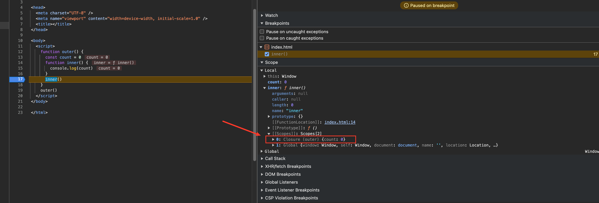
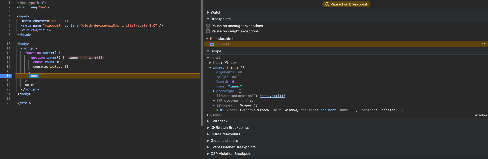

# javaScript

::: tip 本文使用的浏览器
Chrome 版本 124.0.6367.208（正式版本） (arm64)
:::

## 🔸 数据类型

难度：★☆☆☆☆

### 值类型(基本类型)

String、Boolean、Number、Null、Undefined、Symbol、BigInt。

- BigInt 类型在 Javascript 中是一个数字的原始值，它可以表示任意大小的整数。使用 BigInt，你可以安全地存储和操作巨大的整数，甚至超过 Number 的安全整数限制（Number.MAX_SAFE_INTEGER）。
- Symbol 是唯一并且不可变的原始值并且可以用来作为对象属性的键。

### 引用数据类型（对象类型）

Object

## 🔸 类型判断

难度：★☆☆☆☆
typeof 能够检测出 string、number、boolean、function、symbol、bigint。

```ts
typeof 1 // 'number'
typeof '1' // 'string'
typeof true // 'boolean'
typeof undefined // 'undefined'
typeof null // 'object'
typeof [] // 'object'
typeof {} // 'object'
typeof console // 'object'
typeof console.log // 'function'
typeof new Date() // 'object'
typeof Date() // 'string'
typeof Symbol('') // 'symbol'
typeof 1n === 'bigint' // true
typeof BigInt('1') === 'bigint' // true
```

- instanceof 运算符用于检测构造函数的 prototype 属性是否出现在某个实例对象的原型链上。
- 构造函数通过 new 可以实例对象，instanceof 能判断这个对象是否是之前那个构造函数生成的对象。

```ts
function myInstanceof(left, right) {
  // 这里先用typeof来判断基础数据类型，如果是，直接返回false
  if (typeof left !== 'object' || left === null)
    return false
    // getProtypeOf是Object对象自带的API，能够拿到参数的原型对象
  let proto = Object.getPrototypeOf(left)
  while (true) {
    if (proto === null)
      return false
    if (proto === right.prototype)
      return true// 找到相同原型对象，返回true
    proto = Object.getPrototypeof(proto)
  }
}
```

## 🔸 类型转换

难度：★★★☆☆

### 显式转换

- Number()
- parseInt()
- parseFloat()
- String()
- Boolean()

### 隐式转换

- toPrimitive(input: any, preferedType?: 'string' | 'number')
- preferedType=number 调用顺序 1,2,3,4
- preferedType=string 调用顺序 1,3,2,4

1. 基础类型不处理
2. valueOf
3. toString
4. TypeError

| 对象     | valueOf() | toString()             | 默认 preferedType |
| -------- | --------- | ---------------------- | ----------------- |
| Object   | 原值      | "[object Object]"      | Number            |
| Function | 原值      | "function xyz() {...}" | Number            |
| Array    | 原值      | "x,y,z"                | Number            |
| Date     | 数字      | "Sat May 22 2021..."   | String            |

- 数组的toString()可以等效为join(",")，遇到 null、undefined 都被忽略，遇到symbol直接报错，遇到无法ToPrimitive的对象也报错。
- 使用模板字符串或者使用String(...)包装时，preferedType=string，即优先调用 .toString()。
- 使用减法或者Number(...)包装时，preferedType=number，即优先调用.valueOf()。

总结

对象都需要先 ToPrimitive 转成基本类型，除非是宽松相等（==）时两个对象做对比。

- \+ 运算，preferedType 是默认值（见表格），没有字符串就全转数字。
- \- 运算，preferedType 是 Number 全转数字。
- == 同类型不转，数字优先，布尔全转数字，null、undefined、symbol 不转
- < > 数字优先，除非两边都是字符串

参考资料：

- https://segmentfault.com/a/1190000040048164

## 🔸 字符串API

难度：★☆☆☆☆

- substring substring(start, end（不包含）)
- substr（已弃用）substr(start, length)

## 🔸 数组API

难度：★★☆☆☆
改变数组的方法（8种）

- push 方法将指定的元素添加到数组的末尾，并返回新的数组长度。
- unshift 方法将指定元素添加到数组的开头，并返回新的数组长度。
- pop 方法从数组中删除最后一个元素，并返回删除元素的值。
- shift 方法从数组中删除第一个元素，并返回删除元素的值。
- splice 方法就地移除或者替换已存在的元素和/或添加新的元素。splice(start, deleteCount, item1, item2, /\* …, \*/ itemN)
- sort 方法就地对数组的元素进行排序，并返回对相同数组的引用。默认排序是将元素转换为字符串，然后按照它们的 UTF-16 码元值升序排序。
- reverse 方法就地反转数组中的元素，并返回同一数组的引用。数组的第一个元素会变成最后一个，数组的最后一个元素变成第一个。换句话说，数组中的元素顺序将被翻转，变为与之前相反的方向。
- copyWithin 方法浅复制数组的一部分到同一数组中的另一个位置，并返回它，不会改变原数组的长度。copyWithin(target, start, end（不包括）)
  相关方法
- slice 方法返回一个新的数组对象，这一对象是一个由 start 和 end 决定的原数组的浅拷贝 slice(start, end（不包括）)，返回新数组。
- toReversed reverse的复制版本，返回新数组。
- toSorted sort的复制版本，返回新数组。
- toSpliced splice的复制版本，返回新数组。

参考资料:

- https://developer.mozilla.org/zh-CN/docs/Web/JavaScript/Reference/Global_Objects/Array/@@unscopables

## 🔸 原型链 prototype

难度：★★★☆☆

JavaScript 是基于原型的语言。当我们访问一个对象的属性时，如果对象没有该属性，JavaScript 解释器就会从对象的原型对象上去找该属性，如果原型上也没有该属性，那就去找原型的原型，直到最后返回null为止，null没有原型。这种属性查找的方式被称为原型链（prototype chain）。

- prototype: 每一个函数都有一个特殊的属性，叫做原型 (prototype)。
- constructor: 相比于普通对象的属性，prototype 属性本身会有一个属性 constructor，该属性的值为 prototype 所在的函数。
- \_\_proto\_\_: 每一个对象都有一个 \_\_proto\_\_ 属性（不同对象之间的桥梁），该属性指向对象(实例)所属构造函数(类)的原型 prototype。应该为 [[Prototype]]，主流浏览器实现为 \_\_proto\_\_。


- 一切对象都是继承自 Object 对象，Object 对象直接继承根源对象 null。
- 一切的函数对象（包括 Object 对象），都是继承自 Function 对象。
- Object 对象直接继承自 Function 对象。
- Function 对象的 \_\_proto\_\_ 会指向自己的原型对象，最终还是继承自 Object 对象。

## 🔸 创建对象的方式

难度：★★☆☆☆

### 对象字面量

```ts
console.time('函数字面量运行时间')
// 嵌套函数字面量
const Person = {
  name: 'zs'
}
Person.getName = function () {
  console.log(this.name)
}
// 调用方法
Person.getName() // zs
console.timeEnd('函数字面量运行时间') // 0.376953125 ms
```

### [new](https://developer.mozilla.org/zh-CN/docs/Web/JavaScript/Reference/Operators/new)

1. 创建一个新的对象
2. obj将对象与构建函数通过原型链连接起来
3. 将构建函数中的 this 绑定到新建的对象 obj 上
4. 根据构建函数返回类型作判断，如果 `引用类型`，返回 `构造函数原型对象`，否则返回 `新对象`。

```ts
// 构造函数
function Person(name) {
  this.name = name
}
// 原型添加方法
Person.prototype.getName = function () {
  console.log(this.name)
}

console.time('构造函数运行时间')
// 生成实例
const person = new Person('zs')
// 调用方法
person.getName() // zs
console.timeEnd('构造函数运行时间') // 构造函数运行时间: 0.489013671875 ms
```

#### 实现一个 myNew

```ts
function myNew(constructor, ...args) {
  // 1. 创建一个新对象
  const obj = {}
  // 2. 新对象原型指向构造函数原型对象
  Object.setPrototypeOf(obj, constructor.prototype) // obj.__proto__ = constructor.prototype
  // 3. 将构建函数的 this 指向新对象
  const result = constructor.apply(obj, args)
  // 4. 根据返回值判断
  return result instanceof Object ? result : obj
}
function Person(name, age) {
  this.name = name
  this.age = age
}
Person.prototype.say = function () {
  console.log(this.name, this.age)
}

const p = myNew(Person, 'zs', 18)
p.say() // zs 18
```

::: tip
这里 `result instanceof Object` 不能使用 `typeof`，因为 `typeof null === 'object'`。
:::

### Object.create

[Object.create](https://developer.mozilla.org/zh-CN/docs/Web/JavaScript/Reference/Global_Objects/Object/create) 方法创建一个新对象，使用现有的对象来提供新创建的对象的 \_\_proto\_\_。

```ts
console.time('create运行时间')
// 嵌套函数字面量
const Person = Object.create({
  name: 'zs'
})
Person.getName = function () {
  console.log(this.name)
}
// 调用方法
Person.getName() // zs
console.timeEnd('create运行时间') // 0.429931640625 ms
```

```ts
Object.create(null) // 创建一个纯净的对象
const obj = {}
const objCreate = Object.create(null)
console.log(obj.hasOwnProperty) // ƒ hasOwnProperty() { [native code] }
console.log(objCreate.hasOwnProperty) // undefined
```

### 运行时间

对象字面量 < Object.create < new

## 🔸 this

难度：★☆☆☆☆

根据不同的使用场合，this 有不同的值，主要分为下面几种情况：

- 默认绑定
- 隐式绑定
- new 绑定
- 显示绑定
- 箭头函数

### 默认绑定

非严格模式 `this` 指向 `window`

```ts
// eslint-disable-next-line no-var
var name = 'zs'
function person() {
  return this.name
}
console.log(person()) // zs
```

严格模式 `this` 指向 `undefined`

```ts
'use strict'
// eslint-disable-next-line no-var
var name = 'zs'
function person() {
  console.log(this)
}
person() // undefined
```

### 隐式绑定

当函数作为某个对象方法使用时，`this` 指向上级对象。

```ts
function person() {
  console.log(this.name)
}

const obj = {
  name: 'zs',
  person,
  nest: {
    person
  }
}

obj.person() // zs
obj.nest.person() // undefined
```

`this` 永远指向的是最后调用它的对象

```ts
function person() {
  console.log(this)
}

const obj = {
  name: 'zs',
  person
}

const obj2 = obj.person

obj2() // 严格模式 undefined，非严格模式 window
```

### new 绑定

根据构造函数返回类型决定 `this` 指向，参考 [new](/frontend/javaScript.html#new)

```ts
function Person() {
  this.name = 'zs'
  // string、number、boolean、null、undefined、symbol、bigint
  return null
}

const person = new Person()
console.log(person.name) // zs
```

```ts
function Person() {
  this.name = 'zs'
  return {}
}

const person = new Person()
console.log(person.name) // undefined
```

### 显示绑定

参考 [bind、call、apply](/frontend/javaScript.html#bind、call、apply)

### 箭头函数

箭头函数绑定父级作用域的上下文

```ts
const obj = {
  name: 'zs',
  fn() {
    console.log(this.name)
  },
  arrowFn: () => {
    console.log(this)
  }
}
obj.fn() // zs
obj.arrowFn() // this 指向 严格模式 undefined，非严格模式 window
```

## 🔸 bind、call、apply

难度：★☆☆☆☆

- bind Function 实例的 bind() 方法创建一个新函数，当调用该新函数时，它会调用原始函数并将其 this 关键字设置为给定的值，同时，还可以传入一系列指定的参数，这些参数会插入到调用新函数时传入的参数的前面。bind(thisArg, arg1, arg2, /\* …, \*/ argN)

```ts
const obj = {
  name: 'zs',
  say(...args) {
    console.log(this.name, 'Hello world', ...args)
  }
}

setTimeout(obj.say, 0) // '' 'Hello world'   this === window
setTimeout(obj.say.bind(obj, 1, 2), 0) // zs Hello world 1 2

const bindFn = obj.say.bind(obj, 1, 2)

bindFn(3, 4)
```

- apply Function 实例的 apply() 方法会以给定的 this 值和作为数组（或类数组对象）提供的 arguments 调用该函数。

```ts
function fn(...args) {
  console.log(this, args)
}
const obj = {
  name: 'zs'
}
fn.apply(obj, [1, 2]) // this 会变成传入的 obj，传入的参数必须是一个数组
fn(1, 2) // this 指向 严格模式 undefined，非严格模式 window
```

- call 和 apply 使用方式几乎一样，只是参数是一个列表

```ts
function fn(...args) {
  console.log(this, args)
}
const obj = {
  name: 'zs'
}
fn.call(obj, 1, 2) // this 会变成传入的 obj，传入的参数必须是一个数组
fn(1, 2) // this 指向 严格模式 undefined，非严格模式 window
```

当第一个参数传入非引用类型时情况如下：

| 类型      | 严格模式 | 非严格模式                             |
| --------- | -------- | -------------------------------------- |
| string    | 原值     | Object(String()) 等价于 new String()   |
| number    | 原值     | Object(Number()) 等价于 new Number()   |
| boolean   | 原值     | Object(Boolean()) 等价于 new Boolean() |
| null      | 原值     | window                                 |
| undefined | 原值     | window                                 |
| BigInt    | 原值     | Object(BigInt())                       |
| Symbol    | 原值     | Object(Symbol())                       |

:::tip
围绕原始数据类型创建一个显式包装器对象从 ECMAScript 6 开始不再被支持。然而，现有的原始包装器对象，如 new Boolean、new String以及new Number，因为遗留原因仍可被创建。
:::

### 实现一个 myBind

1. 修改 `this` 指向
2. 动态传递参数
3. 兼容 `new` 关键字

🪡 TODO

## 🔸 闭包

难度：★★★☆☆

闭包（closure）是一个函数以及其捆绑的周边环境状态（lexical environment，词法环境）的引用的组合。换而言之，闭包让开发者可以从内部函数访问外部函数的作用域。在 JavaScript 中，闭包会随着函数的创建而被同时创建。

> 简单理解：闭包 = 函数 + 函数外部变量。

### 形成闭包的条件

1. 外部函数
2. 外部函数变量
3. 内部函数
4. 内部函数引用外部函数变量
5. 返回内部函数或通过其他方式保持对内部函数的引用

### 闭包作用

- 封装模块、创建私有变量
- 函数记忆、状态保持、延迟执行函数
- 回调函数

### 闭包的缺陷

- 内存占用：闭包会导致外部函数的变量无法被垃圾回收，从而增加内存占用。如果闭包会长时间存在，那么外部变量将无法被释放，可能导致内存泄漏。
- 性能损耗：闭包涉及到作用域链的查找过程，会带来一定的性能损耗。在性能要求高的场景下，需要注意闭包的使用。

::: tip

- 闭包是 `javaScript` 语言特性
- 闭包不一定需要 `return`
- 闭包不一定会造成内存泄露
- 将闭包引用变量置为 `null`，可手动释放 `闭包` 占用的内存

:::

### 最简单的闭包

```ts
function outer() {
  const count = 0
  function inner() {
    console.log(count)
  }
  inner()
}
outer()
```

在浏览器下可以看到 `count` 变量和 `inner` 函数形成了 `闭包`，后续没有任何引用，`outer()` 执行完毕后生命周期结束。



把 `count` 放到 `inner` 里面看一下效果。

```ts
function outer() {
  function inner() {
    const count = 0
    console.log(count)
  }
  inner()
}
outer()
```



### 闭包的应用

#### 函数记忆

##### 不使用闭包实现

```ts
let count = 0
function sum() {
  count++
  console.log(count)
}
sum()
```

缺点

- `count` 为全局公共变量，容易被污染

**使用 `闭包` 实现**

```ts
function sum() {
  let count = 0
  return function () {
    count++
    console.log(count)
  }
}
const foo = sum()
foo()
foo()
foo()
// 1
// 2
// 3
const bar = sum()
bar()
bar()
bar()
// 1
// 2
// 3
```

优点

- `count` 变量私有化

缺点

- `foo`、`bar` 为全局变量，每次 `sum()` 开辟新的内存，使用完需及时销毁 `foo`、`bar` 变量，否则闭包内的环境会一直占用内存。

**使用 `class` 实现**，使用 `class` 实现性能优于 `闭包`。

```ts
console.time('class')
class Counter {
  constructor() {
    this.count = 0
  }

  add() {
    this.count++
    console.log(this.count)
  }
}
const c = new Counter()
c.add()
c.add()
c.add()
// 1
// 2
// 3
console.timeEnd('class') // class: 0.072998046875 ms

console.time('closure')
function counter() {
  let count = 0
  return function () {
    count++
    console.log(count)
  }
}
const foo = counter()
foo()
foo()
foo()
// 1
// 2
// 3
console.timeEnd('closure') // closure: 0.1240234375 ms
```

#### 私有变量和方法

**使用 `class` 实现**

```ts
class Person {
  #name = 'zs'
  #say() {
    console.log(this.#name, 'Hello world')
  }

  constructor() {
    this.#say()
  }
}
const person = new Person()
// person.#name 报错
// person.#say() 报错
```

**使用 `闭包` 实现**

```ts
function Person() {
  const _name = 'zs'
  const _say = function () {
    console.log(_name, 'Hello world')
  }
  this.say = function () {
    _say()
  }
}

const person = new Person()
person.say()
```

#### 单例模式

**使用 `class` 实现**

```ts
class Singleton {
  constructor() {
    if (Singleton.instance) {
      return Singleton.instance
    }
    this.text = 'Hello world'
    // 只执行一次
    console.log(this.text)
    Singleton.instance = this
  }

  say() {
    console.log('say', this.text)
  }
}
const instance1 = new Singleton()
const instance2 = new Singleton()
instance1.say()
instance2.say()
console.log(instance1 === instance2)
// Hello world
// say Hello world
// say Hello world
// true
```

**使用 `闭包` 实现**

```ts
const say = (function () {
  const text = 'Hello world'
  // 只执行一次
  console.log(text)
  function _say() {
    console.log('say', text)
  }
  return _say
})()
say()
say()
// Hello world
// say Hello world
// say Hello world
```

#### 回调函数

通过回调函数方式防止 `var` 变量提升。

**变量提升**

```ts
const list = []
// eslint-disable-next-line vars-on-top, no-var
for (var i = 0; i < 3; i++) {
  list[i] = function () {
    console.log(i)
  }
}
list[0]()
list[1]()
list[2]()
// 3
// 3
// 3
```

**使用 `闭包` 防止变量提升**

```ts
const list = []
// eslint-disable-next-line vars-on-top, no-var
for (var i = 0; i < 3; i++) {
  (function (i) {
    list[i] = function () {
      console.log(i)
    }
  })(i)
}
list[0]()
list[1]()
list[2]()
// 0
// 1
// 2
```

#### 延迟执行函数

```ts
function delay(message, time) {
  return function () {
    setTimeout(() => {
      console.log(message)
    }, time)
  }
}
const fn = delay('Hello world', 1000)
fn()
```

#### 柯里化函数

🪡 TODO

<script setup></script>
